# Calgary Permit Bot - Architecture Diagram

This document contains the architecture diagram for the Calgary Permit Bot project.

## Architecture Overview

```mermaid
graph TB
    %% User Interface Layer
    User[👤 User]
    
    %% Frontend Layer
    subgraph "Frontend (React + Vite)"
        WebUI[Web UI<br/>React + TypeScript<br/>Fluent UI Components]
        Auth[MSAL Authentication<br/>Azure AD Integration]
    end
    
    %% Application Layer  
    subgraph "Backend (Python)"
        API[REST API Server<br/>Quart Framework<br/>app.py]
        ChatAgent[Chat Agent<br/>Conversation Handler]
        FileUpload[File Upload Handler<br/>PDF/Document Processing]
        SearchAgent[Search Agent<br/>Knowledge Retrieval]
    end
    
    %% Azure AI Services
    subgraph "Azure OpenAI Services"
        ChatGPT[ChatGPT Model<br/>Conversational AI]
        Embeddings[Text Embeddings<br/>Vector Generation]
        GPT4V[GPT-4V Model<br/>Vision Processing]
        EvalModel[Evaluation Model<br/>Quality Assessment]
        SearchAgentModel[Search Agent Model<br/>Retrieval Enhancement]
    end
    
    %% Azure Cognitive Services
    subgraph "Azure Cognitive Services"
        ComputerVision[Computer Vision<br/>Image Analysis]
        DocumentIntel[Document Intelligence<br/>OCR & Form Processing]
        ContentUnderstanding[Content Understanding<br/>Document Analysis]
        SpeechService[Speech Service<br/>TTS/STT]
    end
    
    %% Storage & Search
    subgraph "Data & Search Layer"
        AzureSearch[Azure Cognitive Search<br/>Vector Search & Indexing]
        BlobStorage[Azure Blob Storage<br/>Document Repository]
        CosmosDB[Azure Cosmos DB<br/>Chat History Storage]
    end
    
    %% Hosting & Infrastructure
    subgraph "Hosting Platform"
        AppService[Azure App Service<br/>B1 SKU]
        ContainerApps[Azure Container Apps<br/>Alternative Deployment]
    end
    
    %% Monitoring & Security
    subgraph "Monitoring & Security"
        AppInsights[Application Insights<br/>Telemetry & Monitoring]
        LogAnalytics[Log Analytics<br/>Centralized Logging]
        KeyVault[Azure Key Vault<br/>Secrets Management]
    end
    
    %% Data Sources
    subgraph "Knowledge Base"
        PermitDocs[Permit Documents<br/>data/ folder]
        PDFs[PDF Documents<br/>data_folder/]
        UserUploads[User Uploaded Files<br/>Dynamic Content]
    end
    
    %% Development & Operations
    subgraph "DevOps"
        Bicep[Infrastructure as Code<br/>Bicep Templates]
        Scripts[Automation Scripts<br/>Deployment & Setup]
        Tests[Testing Suite<br/>Unit & E2E Tests]
        Evaluation[Model Evaluation<br/>Quality Metrics]
    end
    
    %% Connections - User Flow
    User --> WebUI
    WebUI --> Auth
    WebUI --> API
    
    %% API to Services
    API --> ChatAgent
    API --> FileUpload
    API --> SearchAgent
    
    %% AI Service Connections
    ChatAgent --> ChatGPT
    SearchAgent --> SearchAgentModel
    FileUpload --> DocumentIntel
    FileUpload --> ComputerVision
    API --> Embeddings
    
    %% Optional Services (dotted lines for conditional features)
    API -.-> GPT4V
    API -.-> EvalModel
    API -.-> SpeechService
    
    %% Data Flow
    SearchAgent --> AzureSearch
    FileUpload --> BlobStorage
    ChatAgent -.-> CosmosDB
    
    %% Knowledge Base Integration
    PermitDocs --> BlobStorage
    PDFs --> BlobStorage
    UserUploads --> BlobStorage
    BlobStorage --> AzureSearch
    
    %% Hosting
    API --> AppService
    WebUI --> AppService
    API -.-> ContainerApps
    
    %% Monitoring
    API --> AppInsights
    AppService --> AppInsights
    AppInsights --> LogAnalytics
    
    %% Infrastructure Management
    Bicep --> AppService
    Bicep --> AzureSearch
    Bicep --> BlobStorage
    Bicep --> CosmosDB
    Scripts --> Bicep
    
    %% Security
    Auth --> KeyVault
    API --> KeyVault
    
    %% Testing & Evaluation
    Tests --> API
    Evaluation --> EvalModel
    
    %% Styling
    classDef userLayer fill:#e1f5fe
    classDef frontendLayer fill:#f3e5f5
    classDef backendLayer fill:#e8f5e8
    classDef aiLayer fill:#fff3e0
    classDef storageLayer fill:#fce4ec
    classDef infraLayer fill:#f1f8e9
    classDef devopsLayer fill:#e0f2f1
    
    class User userLayer
    class WebUI,Auth frontendLayer
    class API,ChatAgent,FileUpload,SearchAgent backendLayer
    class ChatGPT,Embeddings,GPT4V,EvalModel,SearchAgentModel,ComputerVision,DocumentIntel,ContentUnderstanding,SpeechService aiLayer
    class AzureSearch,BlobStorage,CosmosDB,PermitDocs,PDFs,UserUploads storageLayer
    class AppService,ContainerApps,AppInsights,LogAnalytics,KeyVault infraLayer
    class Bicep,Scripts,Tests,Evaluation devopsLayer
```

## Architecture Description

### Frontend Layer
- **React + TypeScript**: Modern web application built with React and TypeScript
- **Fluent UI Components**: Microsoft's design system for consistent UX
- **MSAL Authentication**: Azure Active Directory integration for secure access

### Backend Layer
- **Quart Framework**: Async Python web framework for REST API
- **Chat Agent**: Handles conversational AI interactions
- **File Upload Handler**: Processes PDF and document uploads
- **Search Agent**: Manages knowledge retrieval and search operations

### Azure AI Services
- **ChatGPT**: Primary conversational AI model
- **Text Embeddings**: Vector generation for semantic search
- **GPT-4V**: Vision processing (optional feature)
- **Evaluation Model**: Quality assessment for responses
- **Search Agent Model**: Enhanced retrieval capabilities

### Data & Storage
- **Azure Cognitive Search**: Vector search and document indexing
- **Azure Blob Storage**: Document repository and file storage
- **Azure Cosmos DB**: Chat history and session storage (optional)

### Infrastructure
- **Azure App Service**: Primary hosting platform (B1 SKU)
- **Azure Container Apps**: Alternative deployment option
- **Application Insights**: Monitoring and telemetry
- **Key Vault**: Secure secrets management

## Key Features

1. **Multi-Modal AI**: Text, document, and image processing capabilities
2. **Vector Search**: Semantic search across permit documentation
3. **Real-time Chat**: Interactive conversational interface
4. **Document Processing**: OCR and intelligent form processing
5. **Scalable Architecture**: Support for both App Service and Container Apps
6. **Comprehensive Monitoring**: Full observability with Application Insights
7. **Security First**: Azure AD authentication and Key Vault integration

## Configuration

The architecture is configured through environment variables defined in `infra/main.parameters.json`:

- **App Service SKU**: `${AZURE_APP_SERVICE_SKU=B1}`
- **Deployment Target**: `${DEPLOYMENT_TARGET=containerapps}`
- **AI Models**: Multiple OpenAI model deployments for different purposes
- **Feature Flags**: Optional components like GPT-4V, evaluation, and speech services