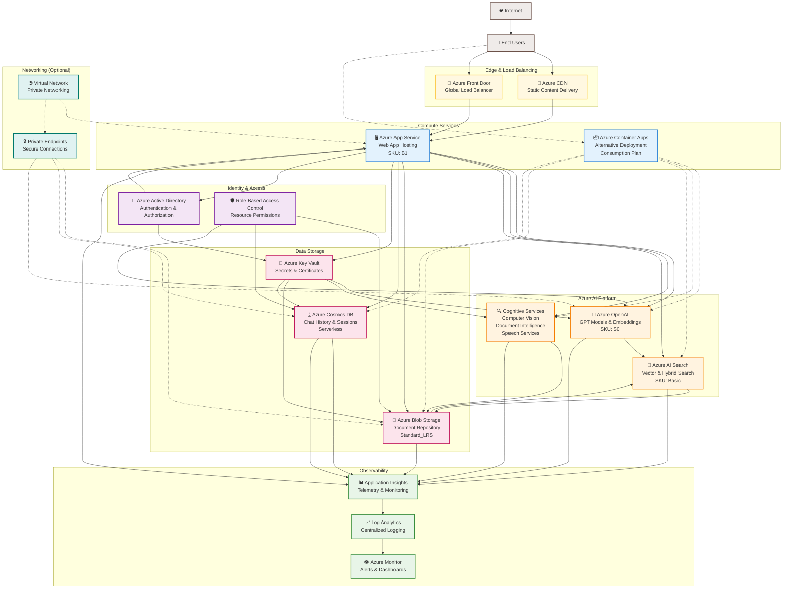
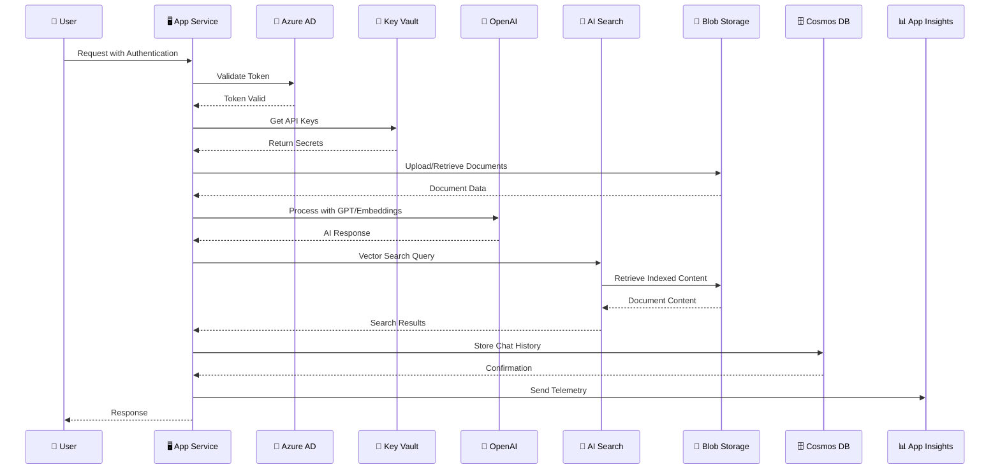
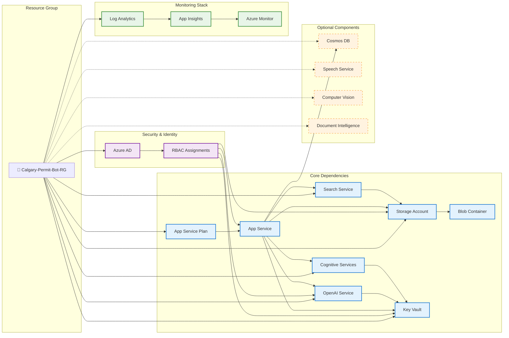

# Calgary Permit Bot - Azure Services Architecture

This diagram shows the high-level Azure services architecture and how different Azure components interact with each other in the Calgary Permit Bot solution.

## Azure Services Interaction Diagram



## Service Communication Patterns



## Azure Resource Dependencies



## Data Flow Patterns

### 1. **Document Processing Flow**
```
User Upload → Blob Storage → AI Search Indexing → Vector Embeddings → Search Index
                ↓
            Document Intelligence → Extracted Text → OpenAI Processing
```

### 2. **Chat Interaction Flow**
```
User Query → App Service → OpenAI (Chat) → AI Search (RAG) → Response
               ↓
        Cosmos DB (History Storage) → Application Insights (Telemetry)
```

### 3. **Authentication Flow**
```
User → Azure AD → JWT Token → App Service → Key Vault (API Keys) → AI Services
```

## Key Integration Points

### **🔗 Service Mesh Connectivity**
- **App Service** ↔ **All AI Services** (Primary compute layer)
- **AI Search** ↔ **Blob Storage** (Document indexing)
- **OpenAI** ↔ **AI Search** (RAG implementation)
- **Key Vault** ↔ **All Services** (Secret management)

### **📊 Monitoring Integration**
- **Application Insights** collects telemetry from all services
- **Log Analytics** centralizes all logs and metrics
- **Azure Monitor** provides alerting and dashboards

### **🔐 Security Integration**
- **Azure AD** provides identity for users and service principals
- **RBAC** controls access to all Azure resources
- **Key Vault** stores all secrets, keys, and certificates
- **Private Endpoints** (optional) for network isolation

### **💰 Cost Optimization**
- **App Service B1**: Cost-effective for moderate workloads
- **AI Search Basic**: Sufficient for most scenarios
- **Cosmos DB Serverless**: Pay-per-use for chat history
- **Storage Standard_LRS**: Cost-effective for document storage

---

*This architecture diagram shows the complete Azure services ecosystem for the Calgary Permit Bot, highlighting service interactions, dependencies, and data flow patterns.*