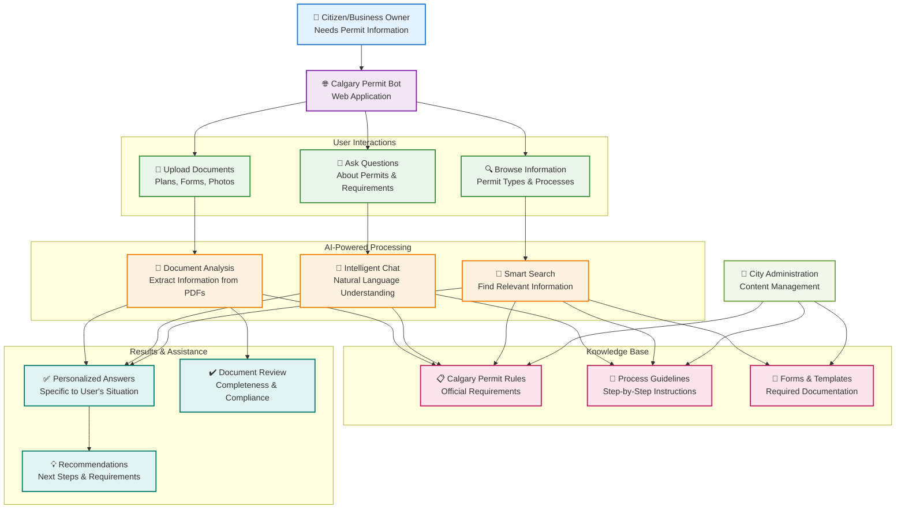
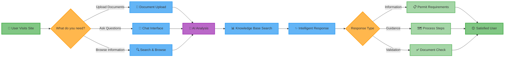
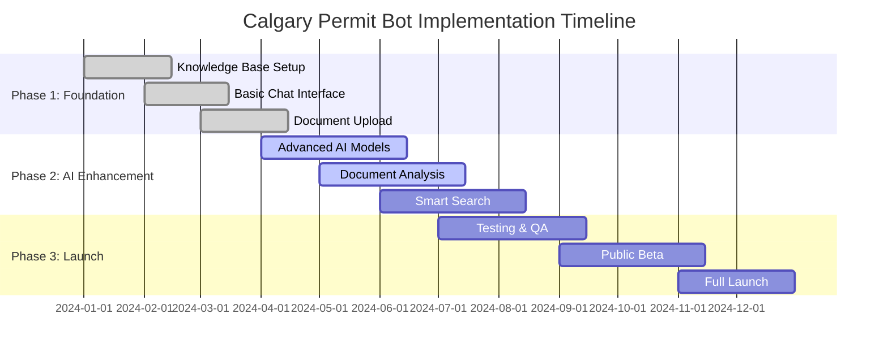

# Calgary Permit Bot - Client Flow Diagram

This diagram shows the high-level user journey and system flow for the Calgary Permit Bot, designed for client presentations and stakeholder communication.

## User Journey Flow

## Simplified Process Flow

## Key Benefits for Citizens

### 🚀 **Faster Service**
- Instant answers to permit questions
- 24/7 availability
- No waiting in lines or phone queues

### 🎯 **Personalized Guidance**
- Tailored responses based on specific projects
- Document validation and feedback
- Step-by-step process guidance

### 📚 **Comprehensive Knowledge**
- Access to all Calgary permit information
- Up-to-date rules and requirements
- Examples and templates

### 🤝 **User-Friendly Experience**
- Natural language conversations
- Simple document upload
- Mobile-friendly interface

## Implementation Phases

## Success Metrics

- **Reduced Call Volume**: 40% decrease in permit-related phone calls
- **Faster Processing**: 60% reduction in application review time
- **User Satisfaction**: 90%+ positive feedback scores
- **24/7 Availability**: Round-the-clock service for citizens
- **Cost Savings**: Reduced administrative overhead

---

*This diagram represents the Calgary Permit Bot's user-focused workflow, designed to improve citizen experience and streamline permit processes through AI-powered assistance.*