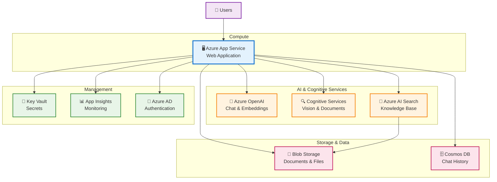
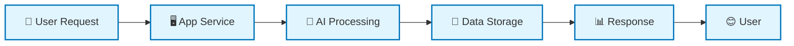

# Calgary Permit Bot - Simplified Azure Architecture

This diagram shows the high-level Azure services architecture with key components and their primary interactions.

## High-Level Azure Services Architecture

## Simplified Data Flow

## Key Components

### **Core Services**
- **Azure App Service**: Hosts the web application
- **Azure OpenAI**: Provides AI chat and text processing
- **Azure AI Search**: Manages knowledge base and search
- **Blob Storage**: Stores documents and files

### **Supporting Services**
- **Cognitive Services**: Handles document and image analysis
- **Cosmos DB**: Stores chat history and user sessions
- **Key Vault**: Manages secrets and API keys
- **Application Insights**: Monitors performance and usage
- **Azure AD**: Handles user authentication

## Architecture Benefits

✅ **Scalable**: Auto-scaling compute and storage  
✅ **Secure**: Enterprise-grade security with Azure AD  
✅ **Intelligent**: AI-powered document processing and chat  
✅ **Monitored**: Complete observability and analytics  
✅ **Cost-Effective**: Pay-as-you-use pricing model  

---

*This simplified architecture focuses on the essential Azure services and their primary relationships for the Calgary Permit Bot solution.*